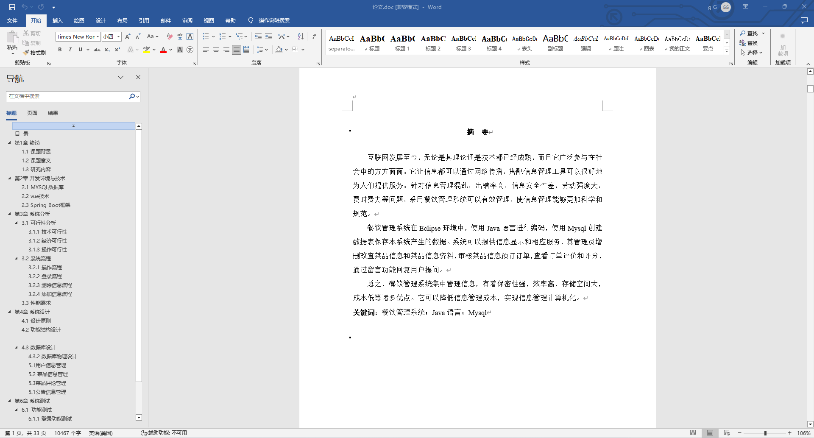
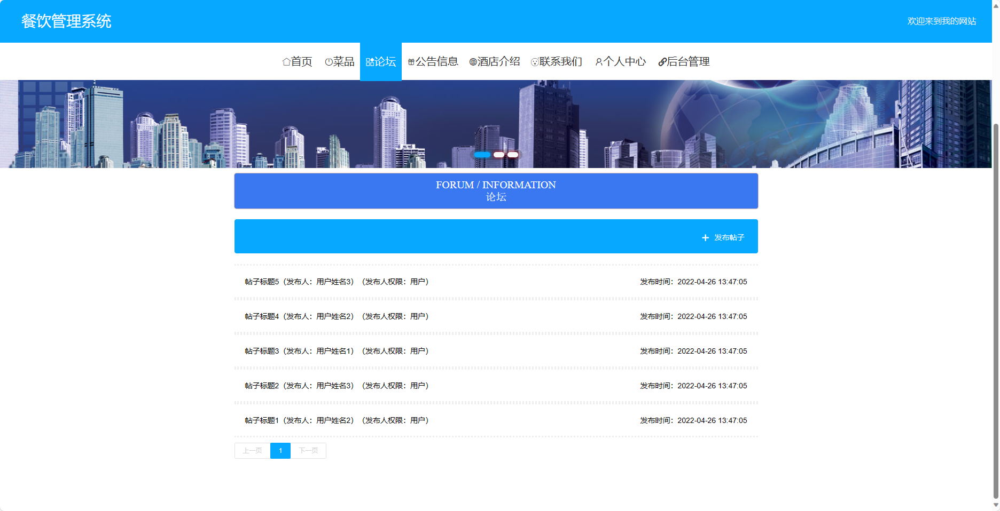
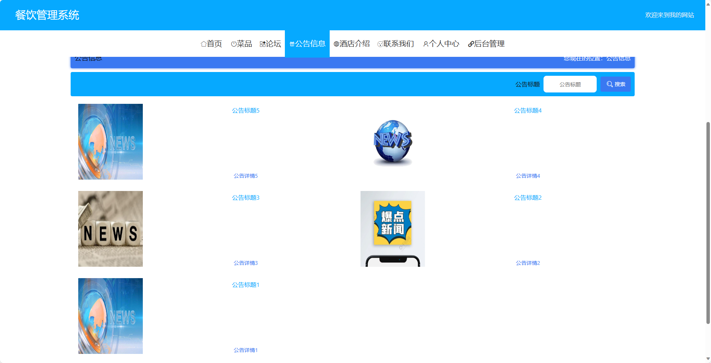
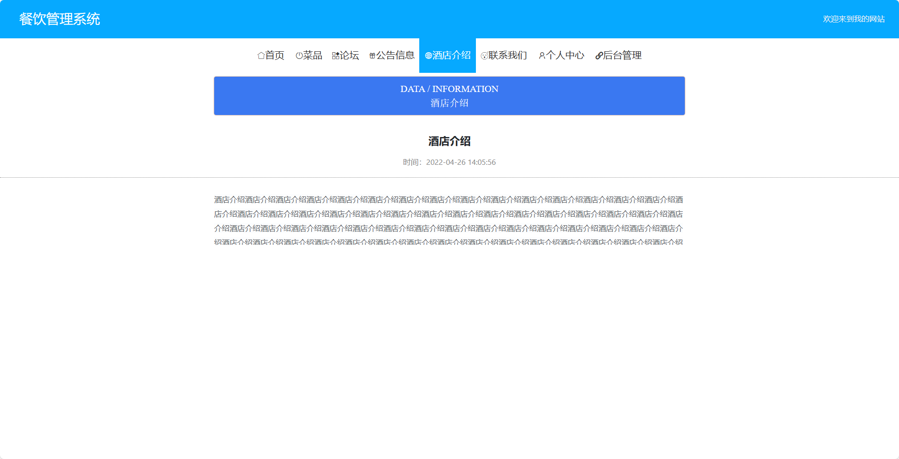
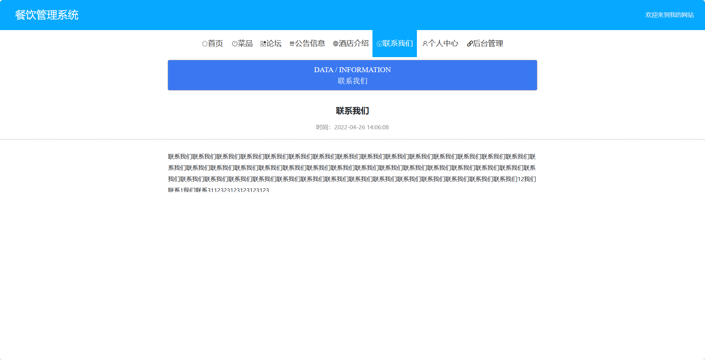
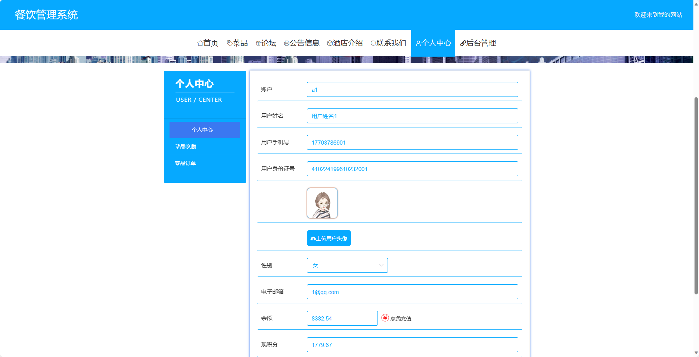
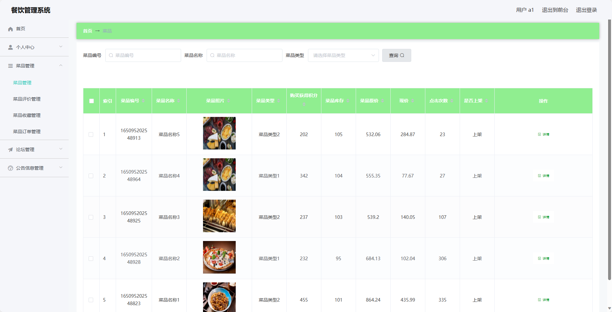

## 基于SpringBoot的餐饮管理系统(程序+报告)

- <b>完整代码获取地址：从戎源码网 ([https://armycodes.com/](https://armycodes.com/))</b>
- <b>技术探讨、资料分享，请加QQ群：692619798</b> 
- <b>作者微信：19941326836  QQ：952045282</b> 
- <b>承接计算机毕业设计、Java毕业设计、Python毕业设计、深度学习、机器学习</b>
- <b>选题+开题报告+任务书+程序定制+安装调试+论文+答辩ppt 一条龙服务</b>
- <b>所有选题地址 ([https://github.com/YuLin-Coder/AllProjectCatalog](https://github.com/YuLin-Coder/AllProjectCatalog)) </b>
## 项目介绍
基于SpringBoot的餐饮管理系统，系统包含三种角色：管理员、员工、用户,系统分为前台和后台两大模块，主要功能如下。

### 【管理员】:
- 个人中心：管理个人信息。
- 管理员管理：管理管理员的信息和权限。
- 菜品管理：创建、修改和删除菜品信息。
- 基础数据管理：管理系统的基础数据。
- 论坛管理：管理论坛中的帖子和评论。
- 供应商管理：管理餐厅的供应商信息。
- 公告信息管理：发布和管理公告信息。
- 单页数据管理：管理餐厅网站的单页内容。
- 用户管理：管理用户的信息和权限。
- 员工管理：管理餐厅的员工信息。
- 轮播图信息：管理餐厅网站首页的轮播图信息。

### 【用户】:
- 个人中心：管理个人信息。
- 菜品管理：查看和点餐菜品。
- 论坛管理：用户可以在论坛中发帖和评论。
- 公告信息管理：查看餐厅发布的公告信息。

### 员工：
- 个人中心：管理个人信息。
- 菜品管理：创建、修改和删除菜品信息。
- 论坛管理：管理论坛中的帖子和评论。
- 供应商管理：管理餐厅的供应商信息。
- 公告信息管理：发布和管理公告信息。

### 【前台】:
- 菜品：查看和点餐菜品。
- 论坛：用户可以在论坛中交流分享餐饮经验。
- 公告信息：查看餐厅发布的公告信息。
- 酒店介绍：展示餐厅的介绍和特色。
- 联系我们：提供餐厅的联系方式。
- 个人中心：管理个人信息。

## 项目技术
- 编程语言：Java
- 数据库：MySQL
- 项目管理工具：Maven
- 前端技术：HTML、CSS、JavaScript、Jquery、Vue
- 后端技术：Spring、SpringMVC、MyBatis

## 运行环境
- JDK版本：JDK1.8及以上
- 开发工具：IDEA、Ecplise、Myecplise都可以
- 数据库: MySQL5.7及以上
- Maven：maven3.0及以上
- Node：14.14.0及以上

## 运行截图

